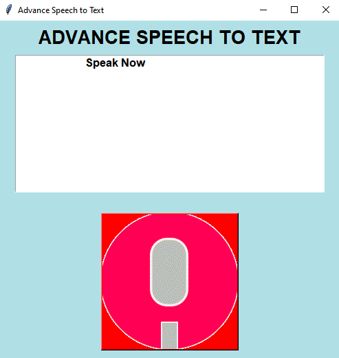

# Speech-to-text
This project is a Python-based application that utilizes speech recognition to convert spoken words into written text. The application provides a graphical user interface (GUI) for ease of use.
<!DOCTYPE html>
<html lang="en">
<h3>Features:</h3>

Speech recognition using the Google Speech Recognition API. 
Support for various punctuation marks and special characters. 
Text-to-speech functionality to playback the recognized text. 
Ability to save the recognized text to a file. 

<h3>Technologies Used:</h3>

Python: Programming language used for the backend logic. 
Tkinter: Python's standard GUI (Graphical User Interface) package used for building the application's interface. 
SpeechRecognition: Python library for speech recognition. 
pyttsx3: Python library for text-to-speech conversion. 
threading: Python library for implementing multi-threading. 

<h3>How to Use:</h3>

Click the microphone button to start speech recognition. 
Speak clearly into the microphone. 
The recognized text will be displayed on the screen. 
Click the microphone button again to stop speech recognition. 

<h3>Future Enhancements:</h3>

Implementing language detection for multilingual support. 
Improving punctuation recognition for better accuracy. 
Adding support for additional speech recognition APIs. 
Feel free to contribute to this project by forking the repository and submitting pull requests. 
  
<h3>Output of the Project</h3>

  
  
  

  

</html>
